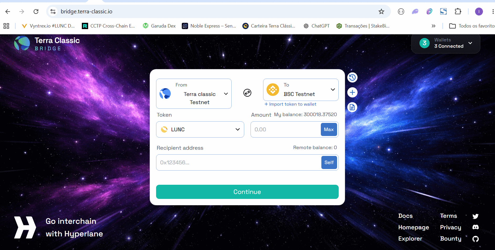

# Terra Classic Bridge UI

> **🌐 Live at: [https://bridge.terra-classic.io](https://bridge.terra-classic.io/)**
>
> This is the official Hyperlane instance for Terra Classic, served from a subdomain of the official Terra Classic website, [terra-classic.io](https://terra-classic.io) — the site listed as the project's official website on [CoinMarketCap](https://coinmarketcap.com/currencies/terra-luna/) and [CoinGecko](https://www.coingecko.com/en/coins/terra-luna-classic). The previous domain [terraclassic-bridge.xyz](https://terraclassic-bridge.xyz/) remains available.
>
> ⚠️ **The warp contracts are still undergoing changes** — contract addresses referenced in this documentation may change.

Web interface for the Terra Classic interchain bridge — **https://bridge.terra-classic.io** — to transfer **LUNC** and **USTC** between Terra Classic, Solana, BNB Chain and Ethereum via [Hyperlane Warp Routes](https://docs.hyperlane.xyz/docs/reference/applications/warp-routes).

[](https://bridge.terra-classic.io/)

*The bridge live at bridge.terra-classic.io: transferring LUNC from Terra Classic to BSC.*

Fork of the official [hyperlane-xyz/hyperlane-warp-ui-template](https://github.com/hyperlane-xyz/hyperlane-warp-ui-template). The LUNC/USTC routes are published in the [official Hyperlane registry](https://github.com/hyperlane-xyz/hyperlane-registry/tree/main/deployments/warp_routes/LUNC) (PRs [#1559](https://github.com/hyperlane-xyz/hyperlane-registry/pull/1559) and [#1687](https://github.com/hyperlane-xyz/hyperlane-registry/pull/1687)).

### ✅ Approved by Terra Classic governance

The Hyperlane integration and this deployment were **approved on-chain** by the network's governance (status `PROPOSAL_STATUS_PASSED`):

- **[Proposal #12200](https://validator.info/terra-classic/governance/12200)** — *Hyperlane Integration on Terra Classic — Multichain Connectivity with Ethereum, BSC, and Solana*
- **[Proposal #12222](https://validator.info/terra-classic/governance/12222)** — *Hyperlane Warp Routes - Solana Mainnet Deployment Funding (LUNC/USTC/CW20)*

Stack: Next.js 15 + React 18, Hyperlane SDK, RainbowKit (EVM), wallet-adapter (Solana), cosmos-kit (Cosmos).

> Historical documentation (old deployment guides, troubleshooting notes and changelogs) is archived in [`docs/archive/`](./docs/archive/).

---

## 1. Configuration

All configuration comes from environment variables. **Important:** `NEXT_PUBLIC_*` variables are baked into the Next.js **build** — changing them after the build has no effect; a rebuild is required.

### Required

| Variable | Description |
| --- | --- |
| `NEXT_PUBLIC_WALLET_CONNECT_ID` | Project ID from [WalletConnect Cloud](https://cloud.walletconnect.com) (required for wallet connections) |

### Administration fee (optional)

A flat USD fee charged per transfer, converted in real time to the origin chain's native token and included **in the same transaction** as the transfer (a single approval). An empty wallet = fee disabled on that chain.

| Variable | Description |
| --- | --- |
| `NEXT_PUBLIC_ADMIN_FEE_USD` | Fee amount in USD (e.g. `0.5`). `0` disables it on all chains |
| `NEXT_PUBLIC_ADMIN_FEE_WALLET_TERRACLASSIC` | `terra1...` wallet that receives the fee on Terra Classic |
| `NEXT_PUBLIC_ADMIN_FEE_WALLET_BSC` | `0x...` wallet on BNB Chain |
| `NEXT_PUBLIC_ADMIN_FEE_WALLET_ETHEREUM` | `0x...` wallet on Ethereum |
| `NEXT_PUBLIC_ADMIN_FEE_WALLET_SOLANA` | Solana wallet (base58) |

### Other optional variables

| Variable | Description |
| --- | --- |
| `NEXT_PUBLIC_TX_MEMO` | Memo written on Cosmos transactions (default `terraclassic-bridge`) |
| `NEXT_PUBLIC_REGISTRY_URL` / `NEXT_PUBLIC_REGISTRY_BRANCH` | Custom Hyperlane registry (default: official registry) |
| `NEXT_PUBLIC_RPC_OVERRIDES` | JSON with custom RPCs per chain: `{"chain":{"http":"https://..."}}` |
| `NEXT_PUBLIC_ALLOWED_CHAIN_DOMAIN_IDS` | Restricts which chains are shown (list of domain IDs) |
| `NEXT_PUBLIC_GITHUB_PROXY` | Proxy for the registry fetches on GitHub |
| `NEXT_PUBLIC_TRANSFER_BLACKLIST` / `NEXT_PUBLIC_CHAIN_WALLET_WHITELISTS` | Route/wallet filters |
| `NEXT_PUBLIC_SENTRY_DSN`, `NEXT_PUBLIC_VERSION`, `NEXT_PUBLIC_REFINER_*` | Telemetry (optional) |

Full template in [`.env.example`](./.env.example).

Routes and branding: `src/consts/warpRoutes.yaml` (tokens), `src/consts/chains.yaml` (chains), `src/consts/app.ts` (name/colors/logos).

## 2. Running locally (development)

Requirements: Node 20+ and `pnpm@10`.

```sh
pnpm install
cp .env.example .env   # fill in at least NEXT_PUBLIC_WALLET_CONNECT_ID
pnpm dev               # http://localhost:3000
```

Checks: `pnpm lint`, `pnpm typecheck`, `pnpm test`.

## 3. Running on a server (production)

### Option A — Docker (recommended)

The `Dockerfile` takes the variables as **build args** (because they are `NEXT_PUBLIC_*`):

```sh
docker build \
  --build-arg NEXT_PUBLIC_WALLET_CONNECT_ID=YOUR_PROJECT_ID \
  --build-arg NEXT_PUBLIC_ADMIN_FEE_USD=0.5 \
  --build-arg NEXT_PUBLIC_ADMIN_FEE_WALLET_TERRACLASSIC=terra1... \
  --build-arg NEXT_PUBLIC_ADMIN_FEE_WALLET_SOLANA=... \
  -t terraclassic-bridge-ui .

docker run -d -p 3000:3000 --restart unless-stopped terraclassic-bridge-ui
```

The app listens on port `3000` (`PORT`/`HOSTNAME` adjustable via environment at runtime). A sample `docker-compose.yml` is also included.

### Option B — EasyPanel (current deployment)

1. Create an **App/Web** app pointing to this repository (branch `main`), built via the Dockerfile.
2. Set the `NEXT_PUBLIC_*` variables in EasyPanel's **build/environment variables _before_ the first build** (they are consumed at build time, not just at runtime).
3. Expose the container port (`3000`) through EasyPanel's proxy/domain.
4. Health check: `HTTP`, path `/api/health`, app port, start period `120s`, interval `30s`, timeout `15s`, retries `5`.
5. To update: push to `main` → rebuild in EasyPanel (or set up automatic builds via webhook).

### Option C — Plain Node

```sh
pnpm install
NEXT_PUBLIC_WALLET_CONNECT_ID=... pnpm build   # variables at build time!
pnpm start                                      # port 3000
```

## 4. License

[Apache 2.0](./LICENSE.md) — inherited from the Hyperlane template.
